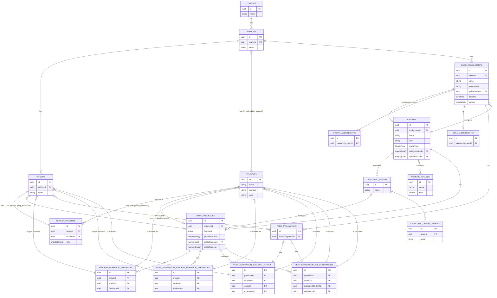

```mermaid
erDiagram
    COURSES {
        uuid id PK
        string name
    }
    
    EDITIONS {
        uuid id PK
        uuid courseId FK
        string name
    }
    COURSES ||--o{ EDITIONS : has
    
    GROUPS {
        uuid id PK
        uuid editionId FK
        string name
    }
    EDITIONS ||--o{ GROUPS : has
    
    STUDENTS {
       uuid id PK
        string name
        string contact
        string note
    }
    EDITIONS }o--o{ STUDENTS : "has (through edition_students)"
    
    GROUP_STUDENTS {
        uuid id PK
        uuid groupId FK
        uuid studentId FK
        maybe(string) role
    }
    STUDENTS ||--o{ GROUP_STUDENTS : belongs_to
    GROUPS ||--o{ GROUP_STUDENTS : has
    
    BASE_ASSIGNMENTS {
        uuid id PK
        uuid editionId FK
        string name
        string assignment
        uuid globalCriterion FK
        datetime deadline
        maybe(int) number
    }
    EDITIONS ||--o{ BASE_ASSIGNMENTS : has
    BASE_ASSIGNMENTS ||--|| CRITERIA : "global/main criterion"
    
    CRITERIA {
        uuid id PK
        uuid assignmentId FK
        string name
        string desc
        GradeType gradeType
        maybe(uuid) categoricGrade FK
        maybe(uuid) numericGrade FK
    }
    CRITERIA ||--o{ BASE_ASSIGNMENTS : belongs_to
    CRITERIA o|--o{ CATEGORIC_GRADES : "if categoric"
    CRITERIA o|--o{ NUMERIC_GRADES : "if numeric"
    
    GROUP_ASSIGNMENTS {
        uuid id PK
        uuid baseAssignmentId FK
    }
    BASE_ASSIGNMENTS ||--o{ GROUP_ASSIGNMENTS : is
    
    SOLO_ASSIGNMENTS {
        uuid id PK
        uuid baseAssignmentId FK
    }
    BASE_ASSIGNMENTS ||--o{ SOLO_ASSIGNMENTS : is
    
    BASE_FEEDBACKS {
        uuid id PK
        uuid criterionId FK
        string feedback
        maybe(string) gradeFreeText
        maybe(uuid) gradeCategoric FK
        maybe(double) gradeNumeric
    }
    CRITERIA ||--o{ BASE_FEEDBACKS : has
    GROUPS }o--o{ BASE_FEEDBACKS : "has (through group_feedbacks)"
    STUDENTS }o--o{ BASE_FEEDBACKS : "has (through solo_feedbacks)"
    CATEGORIC_GRADES |o--o{ BASE_FEEDBACKS : "if categoric"
    
    STUDENT_OVERRIDE_FEEDBACKS {
        uuid id PK
        uuid groupId FK
        uuid studentId FK
        uuid feedbackId FK
    }
    GROUPS }o--|| STUDENT_OVERRIDE_FEEDBACKS : "original feedback"
    STUDENTS }o--|| STUDENT_OVERRIDE_FEEDBACKS : "overridden for"
    BASE_FEEDBACKS ||--o{ STUDENT_OVERRIDE_FEEDBACKS : has
    
    PEER_EVALUATIONS {
        uuid id PK
        uuid baseAssignmentId FK
    }
    BASE_ASSIGNMENTS ||--o{ PEER_EVALUATIONS : has
    GROUPS }o--o{ PEER_EVALUATIONS : "has (through peer_evaluation_groups)"
    
    PEER_EVALUATION_STUDENT_OVERRIDE_FEEDBACKS  {
        uuid id PK
        uuid groupId FK
        uuid studentId FK
        uuid feedbackId FK
    }
    GROUPS }o--|| PEER_EVALUATION_STUDENT_OVERRIDE_FEEDBACKS : "original feedback"
    STUDENTS }o--|| PEER_EVALUATION_STUDENT_OVERRIDE_FEEDBACKS : "overridden for"
    BASE_FEEDBACKS ||--o{ PEER_EVALUATION_STUDENT_OVERRIDE_FEEDBACKS : has
    
    PEER_EVALUATION_S2G_EVALUATIONS {
        uuid id PK
        uuid peerEvalId FK
        uuid studentId FK
        uuid groupId FK
        uuid evaluationId FK
    }
    PEER_EVALUATIONS }o--|| PEER_EVALUATION_S2G_EVALUATIONS : has
    STUDENTS }o--|| PEER_EVALUATION_S2G_EVALUATIONS : "evaluates"
    GROUPS }o--|| PEER_EVALUATION_S2G_EVALUATIONS : "is evaluated"
    BASE_FEEDBACKS ||--o{ PEER_EVALUATION_S2G_EVALUATIONS : "evaluation"
    
    PEER_EVALUATION_S2S_EVALUATIONS {
        uuid id PK
        uuid peerEvalId FK
        uuid studentId FK
        uuid evaluatedStudentId FK
        uuid evaluationId FK
    }
    PEER_EVALUATIONS }o--|| PEER_EVALUATION_S2S_EVALUATIONS : has
    STUDENTS }o--|| PEER_EVALUATION_S2S_EVALUATIONS : "evaluates"
    STUDENTS }o--|| PEER_EVALUATION_S2S_EVALUATIONS : "is evaluated"
    BASE_FEEDBACKS ||--o{ PEER_EVALUATION_S2S_EVALUATIONS : "evaluation"
    
    CATEGORIC_GRADES {
        uuid id PK
        string name
    }
    
    CATEGORIC_GRADE_OPTIONS {
        uuid id PK
        uuid gradeId FK
        string option
    }
    CATEGORIC_GRADES ||--o{ CATEGORIC_GRADE_OPTIONS : has
    
    NUMERIC_GRADES {
        uuid id PK
        string name
        double max
    }
```